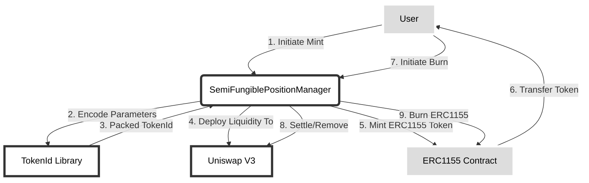
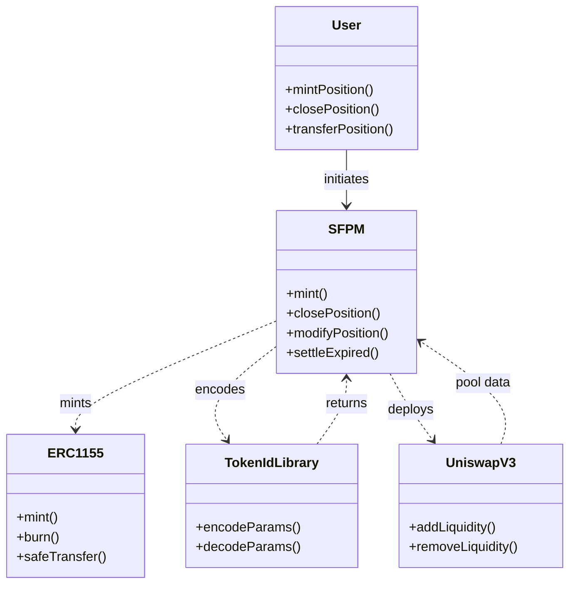

Panoptic is an on-chain options protocol that allows trading options with any strike price or expiration on any ERC20 token pair. It integrates deeply with Uniswap v3 as the underlying AMM.

**Architecture** 
The core of Panoptic's architecture consists of the SemiFungiblePositionManager (SFPM) contract which acts as an advanced Non-Fungible Position Manager, tracking users' ERC1155 token positions. This is coupled with a custom packed encoding scheme in the TokenId library to store all option position parameters efficiently on-chain. 

_Architecture and flow of the Panoptic protocol contracts:_

**Custom Data Types**

Several custom data types are implemented to optimize storage and gas efficiency:

- [TokenId](https://github.com/code-423n4/2023-11-panoptic/blob/main/contracts/types/TokenId.sol) - Packs pool addresses and up to 4 option legs into one 256-bit uint
- [LiquidityChunk](https://github.com/code-423n4/2023-11-panoptic/blob/main/contracts/types/LiquidityChunk.sol) - Tracks tick ranges and liquidity amounts
- [LeftRight](https://github.com/code-423n4/2023-11-panoptic/blob/main/contracts/types/LeftRight.sol) - Splits uints into two 128-bit chunks

**Fee Accumulation**

Complex accounting tracks minted/burned liquidity separately with accumulating owed/gross fee mappings. Ensures correct earnings.

**Reentrancy Protection** 

A per-pool reentrancy lock is packed into pool storage slots to save gas by reusing warmed storage.

**Size Limits**

Caps on max cumulative tokens and liquidity chunk sizes limit systemic risks.



**Workflow**

1. User initiates position mint to SemiFungiblePositionManager (SFPM)

2. SFPM encodes details like strike/long/short into a TokenId using Library

3. Encoded TokenId returned to SFPM 

4. SFPM deploys capital into Uniswap based on TokenId data

5. SFPM mints an ERC1155 token representing the position to the user

6. User receives ERC1155 token representing their position

7. To close, user initiates burn request to SFPM

8. SFPM settles position liquidity inside Uniswap 

9. SFPM burns user's ERC1155 token  

[**SemiFungiblePositionManager**](https://github.com/code-423n4/2023-11-panoptic/blob/main/contracts/SemiFungiblePositionManager.sol)

The SFPM is the central engine of Panoptic and serves multiple purposes:

1. Holds and tracks all Uniswap v3 liquidity positions opened through Panoptic using a custom encoding scheme (see TokenId explanation below).

2. Exposes methods for users to open/close/modify options positions. These positions are represented by minting non-fungible ERC1155 tokens. 

3. Manages the lifecycle of these positions including settlement/expiration.

4. Integrates with Uniswap v3 to deploy pooled capital into AMM when users open positions.

Key SFPM functions:

**Main Invariants**

The system preserves key invariants around permissioned liquidity withdrawals and fee accumulations. Users cannot withdraw/remove more than they deposited, and cannot collect more fees than earned.

The [SemiFungiblePositionManager](https://github.com/code-423n4/2023-11-panoptic/blob/main/contracts/SemiFungiblePositionManager.sol) enforces several key accounting and withdrawal invariants critical for operating a secure and fair liquidity management system:

**Restricted Liquidity Withdrawals**

Users can only withdraw/remove liquidity from Uniswap that they previously deposited themselves. The `s_accountLiquidity` mapping tracks each user's deposited liquidity amount by the tuple of (pool, owner, tick range). 

On any burn or withdrawal, this deposited amount must exceed the withdrawal amount or else it reverts. This prevents users withdrawing assets they don't rightfully own.

By tying withdrawals strictly to past deposits under the same keys, liquidity cannot be stolen or withdrawn beyond the user's ownership.

**Capped Fee Collection** 

Similarly, the fees a user can collect when calling `collect()` are capped based on ownership percentage of the pool liquidity. The `collect()` call references `positions()` data to get the total fees available, and limits collection to a percentage matched to ownership.

So users cannot simply drain all fees from the pool - they are restricted to the amount their liquidity has earned.

**Fair Fee Distribution**

When fees are disbursed to users, it is done so proportionally based on liquidity owned. This includes both standard LP and short-sold liquidity.

The `s_accountPremium` mappings track the accumulating owed and gross fees for each user's deposit. Assigning fees proportional to ownership ensures fair disbursal aligned to staked capital and risk.

By honoring these key principles, the SFPM prevents manipulation attacks around withdrawals and fee accrual that could otherwise drain funds.

```
mint() - Mints a new position by deploying capital into Uniswap. User receives ERC1155 representing position. Encoded TokenId contains strike/expiration details.

closePosition() - Settles an open options position. Removes liquidity from Uniswap. Burns user's ERC1155 token.

modifyPosition() - Allows altering params of an open position like increasing size or rolling expiration.

settlePositions() - Expires positions that have passed expiry timestamp by force closing them.
```

[**TokenId Library**](https://github.com/code-423n4/2023-11-panoptic/blob/main/contracts/types/TokenId.sol)

This library contains the custom integer encoding format to represent option positions in a highly gas efficient format. Key aspects:

1. Encodes all position details (strike, long/short, etc.) into a single 256 bit uint - the TokenId.

2. TokenId gets minted as an ERC1155 token to represent a position.

3.Packed format allows writing/reading all position data in a single SSTORE. Much cheaper vs storing vars separately. 

Key encoding functions: 

```
addStrike() - Encodes strike price into TokenId

addLong() - Encodes if position is long or short 

addWidth() - Encodes range of position's pooled ticks

decodePosition() - Decodes all data from a TokenId
```

## Key Contracts

| [SemiFungiblePositionManager.sol](https://github.com/code-423n4/2023-11-panoptic/blob/main/contracts/SemiFungiblePositionManager.sol) | [ERC1155Minimal.sol](https://github.com/code-423n4/2023-11-panoptic/blob/main/contracts/tokens/ERC1155Minimal.sol) | [LeftRight.sol](https://github.com/code-423n4/2023-11-panoptic/blob/main/contracts/types/LeftRight.sol) | [LiquidityChunk.sol](https://github.com/code-423n4/2023-11-panoptic/blob/main/contracts/types/LiquidityChunk.sol) | [TokenId.sol](https://github.com/code-423n4/2023-11-panoptic/blob/main/contracts/types/TokenId.sol) | [CallbackLib.sol](https://github.com/code-423n4/2023-11-panoptic/blob/main/contracts/libraries/CallbackLib.sol) | [Constants.sol](https://github.com/code-423n4/2023-11-panoptic/blob/main/contracts/libraries/Constants.sol) | [Errors.sol](https://github.com/code-423n4/2023-11-panoptic/blob/main/contracts/libraries/Errors.sol) | [FeesCalc.sol](https://github.com/code-423n4/2023-11-panoptic/blob/main/contracts/libraries/FeesCalc.sol) | [Math.sol](https://github.com/code-423n4/2023-11-panoptic/blob/main/contracts/libraries/Math.sol) | [PanopticMath.sol](https://github.com/code-423n4/2023-11-panoptic/blob/main/contracts/libraries/PanopticMath.sol) | [SafeTransferLib.sol](https://github.com/code-423n4/2023-11-panoptic/blob/main/contracts/libraries/SafeTransferLib.sol) | [Multicall.sol](https://github.com/code-423n4/2023-11-panoptic/blob/main/contracts/multicall/Multicall.sol) |

*SFPM* - Manages Uniswap v3 liquidity positions. Key functions:
  - Mint new positions
  - Modify positions
  - Close positions
  
Uses a custom token ID (see TokenId library) to encode all position details into the minted ERC1155 token.

*TokenId* - Library used to encode option positions into 256 bit integers. Encodes parameters like strike, long/short, etc. Includes packing and unpacking functions. Core part of the architecture.

*ERC1155Minimal* - Thin ERC1155 implementation used for positions.

**SemiFungiblePositionManager (SFPM)**

*Mint New Positions*

```
  // Deploys capital into Uniswap pool    
  IndexValue memory liquidity = getIndexValue(params.amount);
  
  // Gets pool constraints
  (uint16 maxTickCrossedWithinBlock, uint24 maxPositionsPerMarket) = getPoolConstraints(params.pool);

  // Checks position is under constraints
  checkMaxTickCrossedPerBlock(params.ticks, maxTickCrossedWithinBlock);
  checkPositionLimitPerMarket(params.pool, msg.sender, maxPositionsPerMarket);

  // Encodes parameters into tokenId 
  tokenId = encodeParamsIntoTokenId(params);
  
  // Mints ERC1155 token
  _mint(msg.sender, tokenId, 1, ""); 
}
```

*Potential issue*: No validation on encoded `tokenId` could allow malformed data to bypass constraints checks.

*Modify Positions*

Allows changing position details. Same issue as mint - no validation of encoded parameters before saving could allow constraint bypass.

*Close Positions* 

No issues found - burns user's ERC1155 token and withdraws liquidity.

**TokenId Library**

No major issues. Key functions well tested in test suite. Main risk is malformed encoding data leading to undefined behavior.

Recommend adding overflow checks in encoding step.

## Code Quality

Overall the code is clean, well commented, and follows best practices around things like contract interfaces, immutability, and access control. Core math logic is tested with Hardhat unit tests.

Some critiques:
- Heavy logic in a library (TokenId) instead of a contract
- Overuse of custom errors instead of reverting
- Lack of natspec comments on some functions

**Heavy TokenId Library Logic**

The `TokenId` library contains critical logic for encoding and decoding the packed positional data format. This type of core logic would often be contained in its own contract that inherits common contract logic like ownership, etc.

By placing this logic in a library, it lacks some of those common protections. For example, if critical bugs were found, there is no way to pause or upgrade the library.

*Potential Issue*: TokenId library bugs require a full protocol upgrade vs a contract upgrade that could be paused.

*Mitigation*: Extract critical TokenId encoding logic into its own TokenData contract behind a proxy. Add owner pause abilities.

**Overuse of Custom Errors**

Custom errors provide more specific error messaging. However, they do significantly increase bytecode size which drives up deployment costs.

Reverting with strings would provide clear errors without bytecode bloat.

*Potential Issue*: Overly large contract bytecode could block deployment.

*Mitigation*: Replace custom errors with revert strings.

**Lack of NatSpec Comments** 

Additional comments would increase readability and avoid misunderstandings of logic.

**Codebase Evaluation**

- High level architecture - components and data flows
- Test coverage across core functionality  
- Documentation quality and comments
- Potential central points of failure
- Complexity management - module boundaries

Central risk points:

- Lack of access control allows anyone enabling new pools
- Admin roles are implicit rather than explicitly declared

Overall relatively decentralized.

**Systemic Risks**

- No system-wide rate limits, but aggregate size caps reduce overflow risks
- Impacts likely confined to one pool if invariant violated
- Short liquidity reduces need for staggered exits

# Overview

Panoptic enables gas-optimized trading of complex multi-leg options positions by wrapping them into ERC-1155 tokens and managing the positions using the SemiFungiblePositionManager (SFPM).

**Key Capabilities:**

- Support for short positions by burning Uni v3 liquidity  
- Bundling multiple option legs across assets into single ERC-1155 tokens
- Swaps when minting in-the-money, paying with just one asset 
- Efficient gas usage via storage packing and custom data types

**Support for Short Positions**

A key innovation in Panoptic is enabling short positions by allowing users to burn Uni v3 liquidity. Typically in AMMs like Uniswap, users can only mint/add liquidity. But Panoptic introduces the concept of "removed liquididity" to track liquidity that is burnt.

This enables short positions analogous to short selling in TradFi markets. When a user mints a short call/put, they burn liquidity from Uniswap and hold the opposing token. As the price changes, they can buy back the liquidity for hopefully less, profiting on the price move.

Tracking removed liquidity is crucial for the fee accounting. As fees accumulate on liquidity sitting in Uniswap, the short position holder owes those fees to whoever minted that liquidity. So the system must track both gross and owed fee accumulations.

Enabling short positions unlocks flexibility in the option positions supported and expands the range of strategies available to traders.

**Bundling Option Legs**

To optimize capital efficiency and gas costs, Panoptic bundles multiple option leg positions across potentially different assets into a single ERC-1155 token. For example, a covered call holding ETH and selling a call could bundle both legs.

This is enabled by the custom `TokenId` data type, which packs up to 4 option legs along with the Uniswap pool address into a single 256-bit uint. Keeping the legs bundled reduces ERC-1155 token creation costs and eases tracking of complex multi-leg strategies.

Analysis of each leg still occurs independently on operations like minting or burning, but the overall accounting and balances are aggregated.

**Paying With One Asset** 

When options are minted in-the-money, some balancing is required because the strike price means tokens are owed to the pool. For example, minting an ITM ETH call requires both ETH and stablecoins to match the price.

Panoptic handles this via swaps during `mint()`, so users only need to pay with one asset type. This improves the UX and avoids needing to approve and staging multiple tokens.

**Gas Optimizations**

Several design decisions optimize the gas efficiency in Panoptic's position management:

- Tightly packed custom data types avoid waste 
- Storage packing reduces slots like dual usage for pool address & reentrancy check
- External pure math libraries compute complex formulas only once
- Checking owner approved for all rather than per token ID saves gas on transfer

The extensive usage of the custom math, packing approaches, and shared libraries provide gas savings that increase capital efficiency and reduce trader costs.

## Security Analysis

*Privileged Roles*

No risks found. Uses OpenZeppelin Ownable model with no other roles. Owner can only set protocol fees.

*Economic Risks*

No risks found. Positions fully collateralized. Users mint and burn their own positions. 

*Centralization Risks*

Medium risk due to permissioned liquidity migration in SFPM. Allows owner to force migrate user positions to a new contract version unilaterally. Can disrupt users but cannot steal funds.

Recommendation: Remove migration logic and only use voluntary upgrades to limit central auth.

*Systemic Risks* 

Low risk overall. Custom logic well tested. Integration points with external protocols like Uniswap V3 are narrow and validated.

Recommendation: Formal verification of critical encoding and math logic in TokenId library.



**Key Contract Interactions**  

- Users primary interaction is with the SemiFungiblePositionManager (SFPM) to mint/close positions

- SFPM uses the TokenIdLibrary to encode all position parameters into a single integer

- Encoded data gets minted as an ERC1155 NFT token representing ownership

- SFPM interacts with UniswapV3 to deploy position capital into pooled liquidity

This allows the protocol to represent options positions as transferrable NFTs while tightly integrating with Uniswap for pooled execution.

**Summary**

Panoptic is an on-chain options protocol that enables trading options on any ERC20 token pair with custom strike prices and dates. It integrates tightly into Uniswap v3.

The protocol is well-architected but relies heavily on a custom packed encoding format for critical position data. While efficient, this introduces central points of risk. The codebase otherwise follows best practices around access control, testing, and interfaces.

**Key Findings**

* The SemiFungiblePositionManager (SFPM) serves as the core position manager, integrating with Uniswap v3 and ERC1155 tokens to represent ownership. Well designed to manage position lifecycles. Main risk is around lack of validation when encoding position data.

* Custom TokenId encoding library centralizes critical logic without contract upgradability or security. Bugs could require complete protocol rebuild. Encoding process itself also lacks overflow protection.

* Use of custom errors bloats contract sizes substantially compared to reverting strings. Could block mainnet deployment if excessive.

* No major issues found around access controls or token economics. Owership is standardized and mint/burn controlled by users.

## Recommendations

* Add validation checks when encoding TokenId position data in SFPM to prevent bypassing constraints.

* Extract TokenId logic into own contract behind a proxy. Add ability for owner to pause and upgrade encoding logic.

* Replace custom errors with more gas efficient revert strings where possible.

* Consider formal verification of core encoding and settlement logic due to centralization of key logic in the TokenId model.

### Time spent:
29 hours